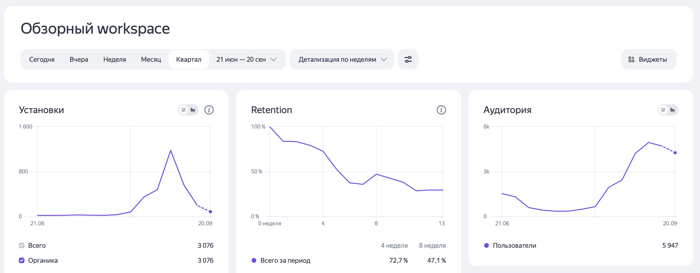

# Навигационное приложение по корпусам СПбПУ

Репозиторий с исходным кодом приложения [PolyMap](https://apps.apple.com/ru/app/polymap/id1589702536). Разработка велась здесь.

Начанался как курсовой проект, перерос в дипломный, и из диплома в стартап UMap (в разработке).  

Конструктор карт в соседнем репозитории в этой же организации.

## Статистика Yandex App Metrica 
